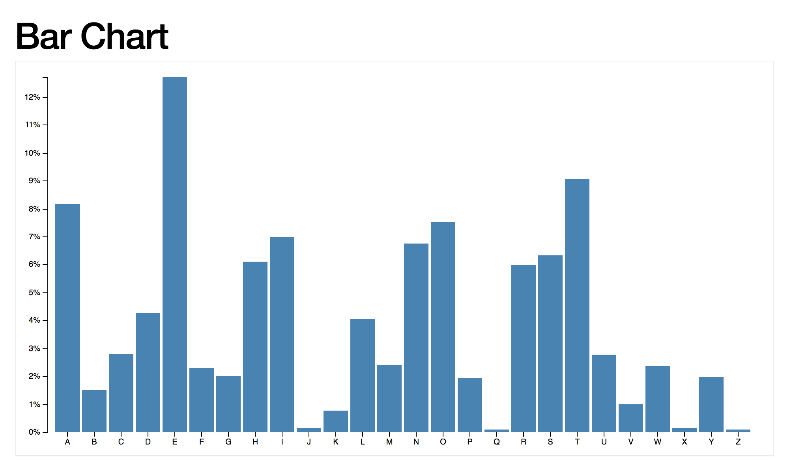
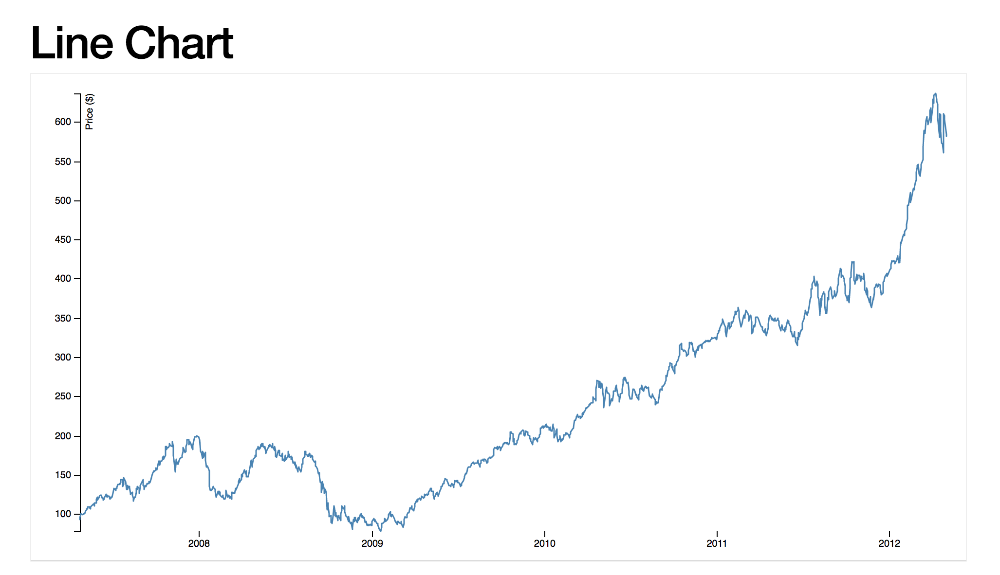
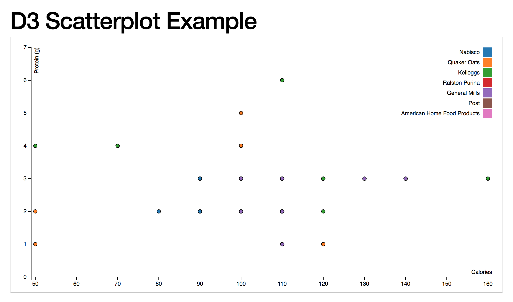

# Data Visualization Workshop

## Sections:

* [What is Data Visualization](#what-is-data-visualization)
* [Types of Visual Diagrams](#types-of-visual-diagrams)
* [D3 API Docs](#d3-api-docs)
* [D3 Workshop content](#d3-workshop-content)
    * [Selections and Data](#selections-and-data)
    * [Selections Demo](#selections-demo)
    * [Enter and Append](#enter-and-append)
    * [Scales and Axes](#scales-and-axes)
    * [First Challenge](#first-challenge)
    * [Shapes](#shapes)
    * [Second Challenge](#second-challenge)
    * [Enter and Update](#enter-and-update)
    * [Exit and Merge](#exit-and-merge)
    * [Transitions](#transitions)
    * [Third Challenge](#third-challenge)
    * [Force Layout](#force-layout)
    * [Position and Collision](#position-and-collision)
    * [D3 and React](#d3-and-react)
* [General Data Visualization Resources](#general-data-visualization)
* [Data Visualization Experts and Companies](#data-visualization-experts-and-companies)

## What is Data Visualization

* Data visualization is the presentation of data in a pictorial or graphical format.
* It enables decision makers to see analytics presented visually
* Decision makers can then grasp difficult concepts or identify new patterns.
* With interactive visualization, you can take concepts further and teach concepts better.
  * You can drill down into charts and graphs for more detail,
  * and interactively change what data you see and how it’s processed.

## Types of Visual Diagrams

A diagram is a symbolic representation of information according to some visualization technique.

### Bar Charts

[Bar Chart](https://en.wikipedia.org/wiki/Bar_chart)

* A bar chart or bar graph is a chart or graph that presents categorical data with rectangular bars with heights or lengths proportional to the values that they represent.
* The bars can be plotted vertically or horizontally.
* A vertical bar chart is sometimes called a line graph.



### Line Charts

[Line Chart](https://en.wikipedia.org/wiki/Line_chart)

* A line chart or line graph is a type of chart which displays information as a series of data points called 'markers' connected by straight line segments.
* It is a basic type of chart common in many fields.
* It is similar to a scatter plot except that the measurement points are ordered (typically by their x-axis value) and joined with straight line segments.
* A line chart is often used to visualize a trend in data over intervals of time – a time series – thus the line is often drawn chronologically.



## Scatter Plots

[Scatter Plots](https://en.wikipedia.org/wiki/Scatter_plot)

* A scatter plot (also called a scatter graph, scatter chart, scattergram, or scatter diagram) is a type of plot or mathematical diagram using Cartesian coordinates to display values for typically two variables for a set of data.
* If the points are color-coded, one additional variable can be displayed.
* The data is displayed as a collection of points, each having the value of one variable determining the position on the horizontal axis and the value of the other variable determining the position on the vertical axis



## D3 API Docs

D3 4.0 is a [collection of modules](https://github.com/d3) that are designed to work together
* You can use the modules independently, or you can use them together as part of the default build.
* The source and documentation for each module is available in its repository.

Follow the links below to learn more:

* [Introduction](https://d3js.org/#introduction)
* [API Reference](https://github.com/d3/d3/blob/master/API.md)
* [Release Notes](https://github.com/d3/d3/blob/master/CHANGES.md)
* [Gallery](https://github.com/d3/d3/wiki/Gallery)
* [Examples](http://bl.ocks.org/mbostock)
* [Tutorials](https://github.com/d3/d3/wiki/Tutorials)
* [Plugins](https://github.com/d3/d3/wiki/Plugins)
* [d3.js on Stack Overflow](http://stackoverflow.com/questions/tagged/d3.js)
* [d3-js Google Group](http://groups.google.com/group/d3-js)
* [d3-js Slack Channel](https://d3js.slack.com) ([Invite](https://d3-slackin.herokuapp.com/))
* [d3-js Gitter Channel](https://gitter.im/d3/d3)
* d3-js IRC Channel => #d3.js on irc.freenode.net

## D3 Workshop content

#### Selections and Data

[D3 Selections Documentation](https://github.com/d3/d3-selection)

* Selections are immutable.
* All selection methods that affect which elements are selected (or their order) return a new selection rather than modifying the current selection.
* However, note that elements are necessarily mutable, as selections drive transformations of the document!

[Selecting Elements](https://github.com/d3/d3-selection#selecting-elements)

```js
var anchor = d3.select("a");
```

This will select the first element that matches the specified selector string.

```js
const enter = svg.selectAll('rect')
```

This will select all elements that match the specified selector string

* If the selector is not a string, instead selects the specified array of nodes
* this is useful if you already have a reference to nodes, such as this.childNodes within an event listener or a global such as document.links

```js
d3.selectAll(document.links).style("color", "red");
```

```js
var even = d3.selectAll("tr").filter(":nth-child(even)");
```

Notice here that you can a css pseudo selector and you can also pass a function

```js
var even = d3.selectAll("tr").filter(function(d, i) { return i & 1; });
```

[Block Builder Editor](http://blockbuilder.org/)

* A very nice editor to build d3 visualizations that get saved as gists

* Click `START CODING` button
* Click Login and you will be routed to github page to authorize application
* You can then save your code here and get interactive editor

#### Selections Demo

[Selections and Data Block Builder Demo](http://blockbuilder.org/jbelmont/f5c73b49d3478dfbb0135148fa04ad92)

[Selections Filter Demo](http://blockbuilder.org/jbelmont/e2017b083240255e42dffd515f9203d1)

**Click `Fork` Button to Play with this on your own**

#### Enter and Append

[D3 Enter docs](https://github.com/d3/d3-selection#selection_enter)

`enter`:

* Returns the enter selection: placeholder nodes for each datum that had no corresponding DOM element in the selection.
* The enter selection is empty for selections not returned by selection.data.

* The enter selection is typically used to create “missing” elements corresponding to new data.
* For example, to create DIV elements from an array of numbers:

```js
const div = d3.select("body")
  .selectAll("div")
  .data([4, 8, 15, 16, 23, 42])
  .enter().append("div")
    .text(d => d);
```

* If the body is initially empty, the above code will create six new DIV elements, append them to the body in-order, and assign their text content as the associated (string-coerced) number:

```html
<div>4</div>
<div>8</div>
<div>15</div>
<div>16</div>
<div>23</div>
<div>42</div>
```

[D3 append docs](https://github.com/d3/d3-selection#selection_append)

* If the specified type is a string, appends a new element of this type (tag name) as the last child of each selected element
* Or before the next following sibling in the update selection if this is an enter selection.

* If the specified type is a function, it is evaluated for each selected element, in order, being passed the current datum (d), the current index (i), and the current group (nodes), with this as the current DOM element (nodes[i]).
* This function should return an element to be appended.

[Enter and Append](http://blockbuilder.org/jbelmont/b3418f3b8f3f90f8de7bc59bc4aa3592)

**Click `Fork` Button to Play with this on your own**

[Enter and Append with Existing Rects](http://blockbuilder.org/jbelmont/bbc300e1ebe57b3f39477845a510eb33)

#### Scales and Axis

[Scales and Axis](http://blockbuilder.org/jbelmont/96f2c14132fb446e839ef8fd9e517267)

**Click `Fork` Button to Play with this on your own**

#### First Challenge

1. Click `New` Button
2. Code your solution
3. If you get stuck check out my solution at [Create a Chart](http://blockbuilder.org/jbelmont/2886fb042412ded3e40bf5cf168413b6)

#### Shapes

[Shapes](http://blockbuilder.org/jbelmont/20804c53bec5b61d17c63d4c02c21c33)

**Click `Fork` Button to Play with this on your own**

#### Second Challenge

1. Click `New` Button
2. Code your solution
3. If you get stuck check out my solution at [Create a line graph](http://blockbuilder.org/jbelmont/5055daf2ad141c7966141611ab4922fc)

#### Enter and Update

[Enter and Update](http://blockbuilder.org/jbelmont/58c7838aa492d04fd95d89c47bbe072e)

**Click `Fork` Button to Play with this on your own**

#### Exit and Merge

[Exit and Merge](http://blockbuilder.org/jbelmont/8c162fe1631bd3453408b6fae52aa970)

**Click `Fork` Button to Play with this on your own**

#### Transitions

[Transitions](http://blockbuilder.org/jbelmont/f97e5d4e4349ecd845ea7004074ddf34)

**Click `Fork` Button to Play with this on your own**

#### Third Challenge

1. Click `New` Button
2. Code your solution
3. If you get stuck check out my solution at [Animating Transitions](http://blockbuilder.org/jbelmont/7c2d9eddc2da2d02da7ec92919f12278)

#### Force Layout

[Force Layout](http://blockbuilder.org/jbelmont/a63ee32b8913e7d1e34c10bb122842f4)

**Click `Fork` Button to Play with this on your own**

#### Position and Collision

[Position and Collision](http://blockbuilder.org/jbelmont/f47a44d3f4f2f05c7cd684a0bf5f6b94)

**Click `Fork` Button to Play with this on your own**

#### D3 and React

[D3 and React](http://blockbuilder.org/jbelmont/b6d4228d1978c568150825f9d575fbcf)

**Click `Fork` Button to Play with this on your own**

## General Data Visualization Resources

* **[Dashing D3js](https://www.dashingd3js.com/table-of-contents)**
* **[Visualizing Data](http://www.visualisingdata.com)** -  a fantastic blog about data visualization. In particular, check out:
* **[The Visualizing Data Resource List](http://www.visualisingdata.com/index.php/resources/)** - A massive list of data visualization tools
* **[The Visualizing Data Dataset List](http://www.visualisingdata.com/index.php/references/)** - *click on 'Data Sources'*.  A list of interesting public data sets.
* **[Flowing Data](http://flowingdata.com)** - another data visualization blog.
* **[Information Aesthetics](http://infosthetics.com)** - Another good blog.

### Data Visualization Experts and Companies
* **[Jer Thorp](http://blog.blprnt.com)** - Data artist.
* **[Nicolas Feltron](http://feltron.tumblr.com)** - Data artist.
* **[Stamen](http://stamen.com)** - Data visualization company, excellent blog, heavy focus on maps.
* **[Fathom](http://fathom.info/latest/)** - Another interesting data visualization company.
* **[Shirley Wu](http://sxywu.com/)** - Excellent blog on Data Visualization.
