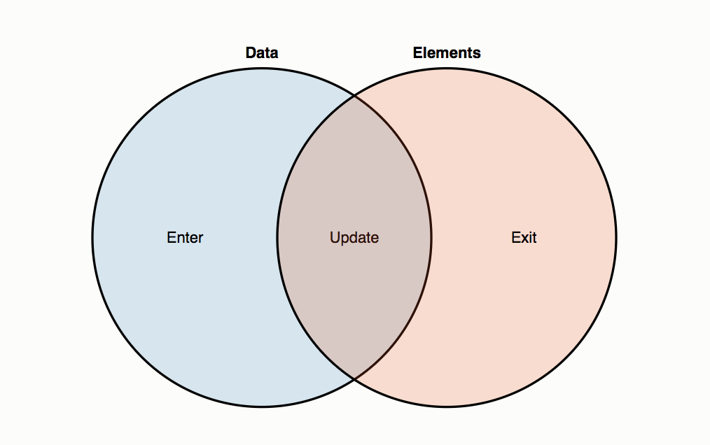

# Data Visualization Workshop - Enter and Update

## Sections:

* [Object Constancy](#object-constancy)
* [Thinking with Joins](#thinking-with-joins)
* [Bread Crumb Navigation](#bread-crumb-navigation)

## Object Constancy

[Mikes Blog Post on Object Constancy](https://bost.ocks.org/mike/constancy/)

> Animated transitions are pretty, but they also serve a purpose: they make it easier to follow the data. This is known as object constancy: a graphical element that represents a particular data point (such as Ohio) can be tracked visually through the transition. This lessens the cognitive burden by using preattentive processing of motion rather than sequential scanning of labels.

* To achieve object constancy with D3.js, specify a key function as the second argument to selection.data.
* This function takes a data point as input and returns a corresponding key: a string, such as a name, that uniquely identifies the data point.

For example, the bar chart above defines data as objects:

```json
{
  "State": "ND",
  "Total": 641481,
  "Under 5 Years": 0.065,
  "5 to 13 Years": 0.105,
  "14 to 17 Years": 0.053,
  "18 to 24 Years": 0.129,
  "16 Years and Over": 0.804,
  "18 Years and Over": 0.777,
  "15 to 44 Years": 0.410,
  "45 to 64 Years": 0.260,
  "65 Years and Over": 0.147,
  "85 Years and Over": 0.028
}
```

with a suitable key function

```js
function key(d) {
  return d.State;
}
```

## Thinking with Joins

[Mike Bostock's Blog Post on Thinking with Joins](https://bost.ocks.org/mike/join/)



* Data points joined to existing elements produce the update (inner) selection.
* Leftover unbound data produce the enter selection (left), which represents missing elements.
* Likewise, any remaining unbound elements produce the exit selection (right), which represents elements to be removed.

`Now we can unravel the mysterious enter-append sequence through the data join`:

1. First, svg.selectAll("circle") returns a new empty selection, since the SVG container was empty. The parent node of this selection is the SVG container.

2. This selection is then joined to an array of data, resulting in three new selections that represent the three possible states: enter, update, and exit. Since the selection was empty, the update and exit selections are empty, while the enter selection contains a placeholder for each new datum.

3. The update selection is returned by selection.data, while the enter and exit selections hang off the update selection; selection.enter thus returns the enter selection.

4. The missing elements are added to the SVG container by calling selection.append on the enter selection. This appends a new circle for each data point to the SVG container.

## Bread Crumb Navigation
_________________________

Previous | Next
:------- | ---:
← [Second Challenge](./second-challenge.md) | [Exit and Merge](./exit-and-merge.md) →
