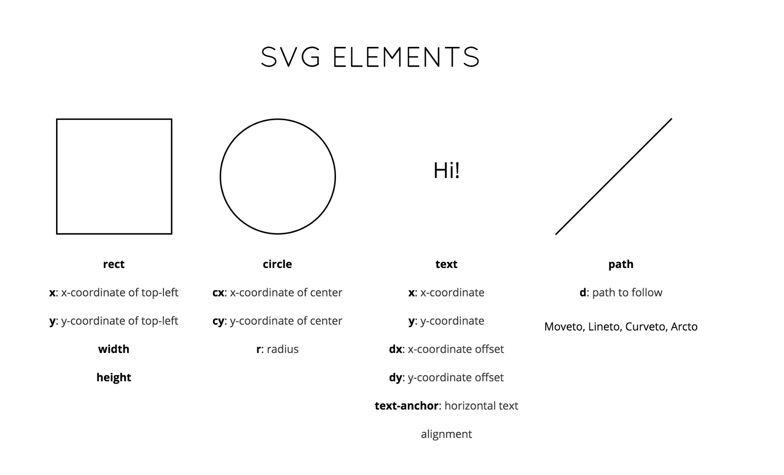
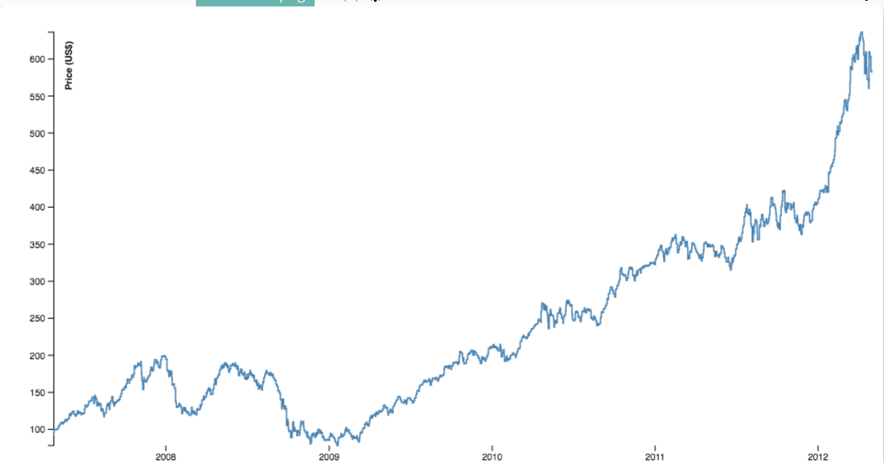

# Data Visualization Workshop - Shapes

## Sections:

* [Shapes](#shapes)
* [SVG Elements](#svg-elements)
* [Path Attribute](#path-attribute)
* [Pie](#pie)
* [Bread Crumb Navigation](#bread-crumb-navigation)

## Shapes



## SVG Elements

[SVG Paths](https://developer.mozilla.org/en-US/docs/Web/SVG/Tutorial/Paths)

[SVG Transform](https://developer.mozilla.org/en-US/docs/Web/SVG/Attribute/transform)

## Path Attribute

* `d3-shape` calculates the path attribute

Imagine if you had to hand code this:

```xml
<svg width="190" height="160" xmlns="http://www.w3.org/2000/svg">

  <path d="M10 10 C 20 20, 40 20, 50 10" stroke="black" fill="transparent"/>
  <path d="M70 10 C 70 20, 120 20, 120 10" stroke="black" fill="transparent"/>
  <path d="M130 10 C 120 20, 180 20, 170 10" stroke="black" fill="transparent"/>
  <path d="M10 60 C 20 80, 40 80, 50 60" stroke="black" fill="transparent"/>
  <path d="M70 60 C 70 80, 110 80, 110 60" stroke="black" fill="transparent"/>
  <path d="M130 60 C 120 80, 180 80, 170 60" stroke="black" fill="transparent"/>
  <path d="M10 110 C 20 140, 40 140, 50 110" stroke="black" fill="transparent"/>
  <path d="M70 110 C 70 140, 110 140, 110 110" stroke="black" fill="transparent"/>
  <path d="M130 110 C 120 140, 180 140, 170 110" stroke="black" fill="transparent"/>

</svg>
```



## Pie

[Pie Chart](https://github.com/d3/d3-shape#pies)

* The pie generator does not produce a shape directly, but instead computes the necessary angles to represent a tabular dataset as a pie or donut chart
* These angles can then be passed to an arc generator

[D3 shape `pie` method](https://github.com/d3/d3-shape#pie)

* Constructs a new pie generator with the default settings.

[D3 shape `arc` method](https://github.com/d3/d3-shape#arc)

* Constructs a new arc generator with the default settings.

[D3 shape `arc` with args method](https://github.com/d3/d3-shape#_arc)

If the radii and angles are instead defined as constants, you can generate an arc without any arguments:

```js
var arc = d3.arc()
    .innerRadius(0)
    .outerRadius(100)
    .startAngle(0)
    .endAngle(Math.PI / 2);

arc(); // "M0,-100A100,100,0,0,1,100,0L0,0Z"
```

[Area Chart](http://blockbuilder.org/jbelmont/fa75876b679907a613d61805c37231a8)

## Bread Crumb Navigation
_________________________

Previous | Next
:------- | ---:
← [First Challenge](./first-challenge.md) | [Second Challenge](./second-challenge.md) →
